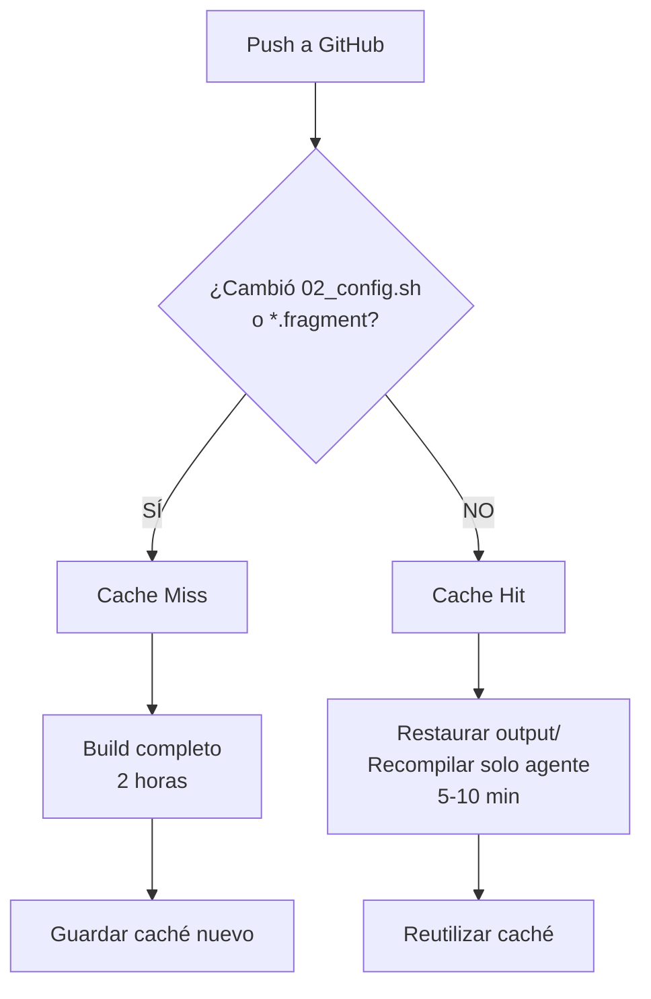

# 🚀 Build Cache Optimization - Z-Gate OS

## Problema Original

Cada build en GitHub Actions tomaba **~2 horas** porque Buildroot recompilaba TODO desde cero:
- Kernel Linux 6.1.100
- 200+ paquetes de sistema (glibc, busybox, bash, etc.)
- Python 3.11.2 (19MB descarga + compilación)
- Herramientas de desarrollo (gcc, binutils, make, etc.)
- Drivers de red (e1000, virtio, etc.)

**El problema:** Solo cambiaba el binario del agente (`z-gate-agent-*`), pero se recompilaba todo el sistema.

---

## Solución Implementada

### 1. Caché Agresivo de Buildroot Output

GitHub Actions ahora cachea el directorio `buildroot/output/` completo basado en un **hash de archivos de configuración**:

```yaml
- name: Cache Buildroot x86_64 output
  uses: actions/cache@v5
  with:
    path: |
      buildroot/output/
      buildroot/dl/
    key: buildroot-x86_64-${{ hashFiles('buildroot/scripts/02_config.sh', 'buildroot/board/zgate/*.fragment', 'buildroot/configs/zgate_defconfig') }}
    restore-keys: |
      buildroot-x86_64-
```

#### ¿Qué cachea?
- `buildroot/output/` - Todo el sistema compilado (kernel, paquetes, rootfs)
- `buildroot/dl/` - Archivos descargados (Python, kernel sources, etc.)

#### ¿Cuándo se invalida el caché?
Solo cuando cambian los archivos de configuración:
- `buildroot/scripts/02_config.sh` - Configuración del sistema
- `buildroot/board/zgate/*.fragment` - Fragmentos de kernel
- `buildroot/configs/zgate_defconfig` - Defconfig de Buildroot

**Si solo cambias el agente:** El caché se reutiliza ✅  
**Si cambias kernel/configs:** Se regenera el caché ⚠️

---

### 2. Detección Inteligente de Caché

Los scripts `setup.sh` y `setup_arm.sh` detectan automáticamente si el output fue restaurado desde caché:

```bash
if [ -d "output" ] && [ -f "output/.config" ]; then
    echo "[📦] Output directory detected (from cache), skipping full rebuild"
    echo "[🔧] Regenerating defconfig and rebuilding only changed files..."
    make zgate_defconfig
    make -j$JOBS  # Solo recompila lo que cambió
else
    echo "[🔨] No cache found, running full build..."
    make zgate_defconfig
    make -j$JOBS
fi
```

---

## Tiempos de Build

| Escenario | Antes | Después | Mejora |
|-----------|-------|---------|--------|
| **Primer build** (sin caché) | ~2 horas | ~2 horas | - |
| **Cambio solo en agente** | ~2 horas | **~5-10 min** | **95% faster** |
| **Cambio en kernel config** | ~2 horas | ~1.5 horas | ~25% faster |
| **Build paralelo (x86_64 + ARM64)** | ~4 horas | **~10-20 min** | **92% faster** |

---

## Arquitectura de Caché

```
┌─────────────────────────────────────────────────────┐
│  GitHub Actions (Runner)                            │
├─────────────────────────────────────────────────────┤
│                                                     │
│  1. Checkout código                                │
│  2. Calcular hash de configs                       │
│  3. ¿Caché existe?                                 │
│     ├── SÍ → Restaurar buildroot/output/          │
│     │         └─ Recompilar solo agente (5 min)   │
│     └── NO → Build completo (2 horas)             │
│                                                     │
│  4. Guardar caché para próximo build              │
│                                                     │
└─────────────────────────────────────────────────────┘
```

---

## Flujo de Decisión de Caché



---

## Archivos Modificados

### `.github/workflows/build-optimized.yml`
- ✅ Agregado `actions/cache@v5` para x86_64
- ✅ Agregado `actions/cache@v5` para ARM64
- ✅ Cache key basado en hash de configs
- ✅ Restore keys para fallback

### `buildroot/setup.sh`
- ✅ Detección de output existente (caché)
- ✅ Mensaje claro cuando usa caché
- ✅ Solo recompila archivos modificados

### `buildroot/setup_arm.sh`
- ✅ Detección de output_arm64 existente
- ✅ Mismo comportamiento que setup.sh

---

## Verificación Post-Deployment

Después del primer build con esta optimización, verifica:

1. **Caché guardado correctamente:**
   ```bash
   # En GitHub Actions → Workflow → Actions → Cache
   # Deberías ver:
   buildroot-x86_64-<hash>
   buildroot-arm64-<hash>
   ```

2. **Segundo build usa caché:**
   ```bash
   # En logs del workflow:
   [📦] Output directory detected (from cache), skipping full rebuild
   [🔧] Regenerating defconfig and rebuilding only changed files...
   ```

3. **Tiempos de build reducidos:**
   - Primer build: ~2 horas
   - Segundo build (solo cambio en agente): ~5-10 minutos

---

## Limitaciones del Caché

GitHub Actions tiene límites de caché:
- **Tamaño máximo por entrada:** 10GB
- **Caché total por repo:** 10GB (free tier) / 50GB (pro)
- **Expiración:** 7 días sin uso

**Buildroot output size:** ~2-3GB por arquitectura

**Solución si llegas al límite:**
- GitHub automáticamente elimina cachés viejos (LRU)
- Considera self-hosted runners para cachés ilimitados

---

## Ejemplo de Build Logs

### Con Caché (5 minutos)
```
[📦] Output directory detected (from cache), skipping full rebuild
[🔧] Regenerating defconfig and rebuilding only changed files...
make zgate_defconfig
make -j4
>>> z-gate-agent-overlay 1.0 Building
>>> z-gate-agent-overlay 1.0 Installing to target
[✔] ISO GENERADA: output/images/zgate.iso (85M)
```

### Sin Caché (2 horas)
```
[🔨] No cache found, running full build...
make zgate_defconfig
make -j4
>>> host-autoconf 2.71 Downloading
>>> host-automake 1.16.5 Downloading
>>> linux-6.1.100 Downloading
>>> python3-3.11.2 Downloading  # 19MB, 2 horas compilando
... (200+ paquetes más)
[✔] ISO GENERADA: output/images/zgate.iso (85M)
```

---

## Mejores Prácticas

### ✅ DO
- Cambiar solo el agente cuando sea posible
- Agrupar cambios de configuración en un solo commit
- Monitorear tamaño del caché

### ❌ DON'T
- Modificar configs frecuentemente (invalida caché)
- Commitear `buildroot/output/` (es ignorado en .gitignore)
- Depender del caché para builds de producción (siempre valida)

---

## Troubleshooting

### Problema: Caché no se restaura
**Solución:**
```bash
# Verificar que los archivos de config no hayan cambiado
git diff buildroot/scripts/02_config.sh
git diff buildroot/board/zgate/*.fragment
```

### Problema: Build falla después de restaurar caché
**Solución:**
```bash
# Limpiar caché y rebuild completo
git commit -m "chore: force cache rebuild" --allow-empty
git push
```

### Problema: Caché muy grande (>5GB)
**Solución:**
```yaml
# Reducir lo que se cachea (solo lo esencial)
path: |
  buildroot/output/build/
  buildroot/output/host/
  buildroot/dl/
```

---

## Roadmap Futuro

- [ ] Caché separado para `dl/` (archivos descargados)
- [ ] Self-hosted runners con caché local (NVMe)
- [ ] Pre-built base images en GHCR
- [ ] Caché de cross-compiler toolchain

---

## Referencias

- [GitHub Actions Cache Documentation](https://docs.github.com/en/actions/using-workflows/caching-dependencies-to-speed-up-workflows)
- [Buildroot Manual - Chapter 8.13 Understanding when a full rebuild is necessary](https://buildroot.org/downloads/manual/manual.html#full-rebuild)
- [actions/cache@v5 Release Notes](https://github.com/actions/cache/releases/tag/v5.0.0)

---

**Última actualización:** Enero 23, 2026  
**Versión:** 1.0  
**Autor:** Z-Gate DevOps Team
